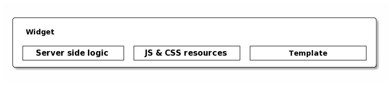

=======================
Hello World Moksha Demo
=======================

The goal of this tutorial is to show the simplicity of Moksha's API by creating
basic "Hello World" components in one demo.

:Download: https://fedorahosted.org/releases/m/o/moksha/moksha-helloworld.tar.bz2
:Browse Source: https://fedorahosted.org/moksha/browser/moksha/apps/helloworld

.. note::

   You can easily run this demo by extracting the above tarball, and running ``moksha start`` within it.

The Controller
--------------

This is the most basic of TurboGears controllers.

``demo/controllers/root.py``

.. code-block:: python

   from tg import expose

   class Root(object):

       @expose()
       def index(self):
           return 'Hello World!'

Ok, so here we have a trivial TurboGears controller that simply renders "Hello
World".  So how do we plug this into Moksha and actually run it?

Let's say we want this controller method to be the root of our application.  To
accomplish this we add it to the ``[moksha.root]`` entry-point in our ``setup.py``::

    [moksha.root]
    root = demo.controllers.root:Root

.. note::

   Any time you modify any entry-points in your setup.py/pavement.py, you must regenerate
   the egg info by running ``python setup.py egg_info``

.. seealso::

   :doc:`PluginEntryPoints`

Running the Moksha stack
------------------------

The Moksha Stack is comprised of a WSGI application, Orbited, and the Moksha
Hub.  These pieces can be deployed and run in a variety of ways (see the
:doc:`Deployment` guide for more information), but the easiest way to get them
running is with the :doc:`MokshaCLI`.

.. code-block:: bash

   $ moksha start

Now when we fetch the index page, Moksha will dispatch the request to our new controller.

.. code-block:: bash

   $ curl http://localhost:8080/
   Hello World

Bringing a templating engine into the mix
-----------------------------------------

The previous example just returned a string from our controller.  What if we
want to use one of the many powerful templating engines out there?

TurboGears supports a variety of engines, including Genshi, Mako, Jinja, Cheetah, etc.

For this example let's just create a dead simple `Mako <http://makotemplates.org>`_ template.

``demo/templates/template.mak``

.. code-block:: html

   <html>
     <head><title>${msg}</title></head>
     <body>${msg}</body>
   </html>

Now let's plug in our Mako template into our Root controller.

.. code-block:: python

   @expose('mako:demo.templates.template')
   def index(self):
       """ An example controller method exposed with a Mako template """
       return {'msg': 'Hello World!'}

Building a basic Widget
-----------------------

A "Widget" is simply a Python object that contains references to CSS/JavaScript
resources, a template, and server-side render-time logic.

In TurboGears, and thus Moksha, the widget framework of choice is `ToscaWidget
<http://toscawidgets.org>`_, which allows you to create modular components that
can be re-used throughout your application.  As mentioned in :doc:`Widgets`,
there are two major versions of ToscaWidgets (ToscaWidgets1 and ToscaWidgets2).
Lucky for you, Moksha supports both.

For ToscaWidgets1:

.. code-block:: python

   from tw.api import Widget

   class HelloWorldWidget(Widget):
       params = ['msg']     # The parameters that this widget takes
       msg = 'Hello World'  # The default message value
       template = '${msg}'  # The widget template, which has access to all of the `params`.
                            # The template can be either a string or also an external reference like,
                            # template = 'mako:myproject.templates.widgettemplate'
       engine_name = 'mako' # The template engine. Unnecessary if referencing an external template.

       def update_params(self, d):
           """ Render-time logic """
           super(HelloWorldWidget, self).update_params(d)
           # This code will be executed when the widget is rendering during each request.
           # The argument `d` contains the widget data and params.
           # So d.msg would currently be be 'Hello World'.  Let's modify it.
           d.msg = d.msg + "!"

For ToscaWidgets2:

.. code-block:: python

   from tw2.core import Widget, Param

   class HelloWorldWidget(Widget):
       msg = Param("A message", default='Hello World')
       template = '${msg}'  # The widget template, which has access to all of the `params`.
                            # The template can be either a string or also an external reference like,
                            # template = 'mako:myproject.templates.widgettemplate'

       def prepare(self):
           """ Render-time logic """
           super(HelloWorldWidget, self).prepare()
           self.msg = self.msg + "!"

You can then plug this widget into the ``[moksha.widget]`` entry-point.

``setup.py``

.. code-block:: python

   [moksha.widget]
   basic = demo.widgets:HelloWorldWidget

Moksha will expose your widget on the /widgets/$NAME URL.  Since we named this widget 'basic' on the
entry-point, we can fetch it like so:

.. code-block:: bash

   $ curl http://localhost:8080/widgets/basic

.. code-block:: html

   <html>
     <head></head>
     <body>Hello World!</body>
   </html>

You can also pass in different parameters to your widget via the URL.

.. code-block:: bash

   $ curl http://localhost:8080/widgets/basic?msg=foobar

.. code-block:: html

   <html>
     <head></head>
     <body>foobar!</body>
   </html>

.. seealso::

    :doc:`Widgets`

.. seealso::

   `TG2 TW docs <http://turbogears.org/2.1/docs/main/ToscaWidgets/ToscaWidgets.html>`_

Real-time Messaging
-------------------

Now that we've got the basics out of the way, we can finally move on to the fun stuff -- *messaging*.

One of the features that makes Moksha unique in the web framework world is that
it encorporates a Message Broker into the mix, allowing you to create highly
responsive and interactive web applications.

Traditionally, the messaging world is full of acronyms (AMQP, STOMP) and
complexity (queues, exchanges, binding keys, flow control).  Moksha, on the
other hand, aims to provide a high level abstraction on top of these concepts,
while offering a trivial API for people to utilize them with ease.

The primary messaging concepts that Moksha defines are **Producers** and
**Consumers**.  These are objects that produce messages, along with objects
that consume them.  Each of which communicate over specific **Topics**.

.. seealso::

   :doc:`Messaging`

Creating a message producer
---------------------------

A Producer in Moksha does what you would expect, sends messages to the broker.
Let's say you want a Producer that wakes up every 3 seconds, performs some
task, and sends a message.  Moksha provides a ``PollingProducer`` class that
can do just this.

.. code-block:: python

   from datetime import timedelta
   from moksha.api.hub.producer import PollingProducer

   class HelloWorldProducer(PollingProducer):
       frequency = timedelta(seconds=3)

       def poll(self):
           self.send_message('helloworld', {'msg': 'Hello World!'})

This ``HelloWorldProducer``, which will be initialized by the :doc:`MokshaHub`,
wakes up every 3 seconds, and sends a 'Hello World!' message to the
``helloworld`` :doc:`Topic`.

.. note::

   As with all of the other examples above, you must plug your object into a
   moksha entry-point in your setup.py.  For the case of producers, it is the
   ``[moksha.producer]`` entry-point.  This allows the ``moksha-hub`` to detect
   your plugin and initialize/run it as necessary.

.. seealso::

   :doc:`Producers`

Creating a message consumer
---------------------------

The moksha Consumer API lets you create a simple Python object with a consume
method that will be executed with each new message as it is received from the
broker.

``demo/consumer.py``

.. code-block:: python

   from moksha.api.hub.consumer import Consumer
   from demo.model import HelloWorldModel

   class HelloWorldConsumer(Consumer):
       topic = 'helloworld'

       def consume(self, message):
           self.log.info('Received message: ' + message['body']['msg'])

This example listens to the ``helloworld`` topic, and simply logs each message that it receives.

.. seealso::

   :doc:`Consumers`

Running the Moksha Hub
----------------------

The ``moksha-hub`` is a service that runs outside of the web application. It
handles loading all of the producers and consumers, as well as communicating
with the message broker.

.. image:: ../_static/moksha-hub.png

.. note::

   The Moksha Hub is automatically started when you run
   ``./moksha-ctl.py start:moksha-hub``, but you
   can also start it by running ``moksha-hub``.

.. seealso::

   :doc:`MokshaHub`

Creating a Live Widget!
-----------------------

So producers and consumers work inside of the moksha-hub.  Moksha's Live Widgets, on the other hand, can produce and consume messages **in the web browser**.

Moksha provides an API for creating "live widgets".  Making a widget "live"
entails having it "subscribe" to "topics" and perform some action upon new
messages as they arrive in the users web browser.

.. image:: ../_static/live_widgets.png

`demo/widget.py`

.. code-block:: python

   from moksha.api.widgets.live import LiveWidget

   class HelloWorldWidget(LiveWidget):
       topic = "helloworld"
       template = """
           <b>Hello World Widget</b>
           <ul id="data"/>
       """
       onmessage = """
           $('<li/>').text(json.msg).prependTo('#data');
       """

.. note::

   To make moksha aware of this widget, you have to add it to the
   ``[moksha.widget]`` entry-point in your setup.py

This widget will automatically be subscribed to the ``helloworld`` topic, and
the ``onmessage`` javascript callback will be run every time a new message
arrives with the decode JSON data available in the ``json`` variable.  Moksha
handles all of the work behind the scenes subscribing to the appropriate
message queues, decoding JSON data, and dispatching messages to the appropriate
widgets.

You can view this widget multiple ways.  First being via the standard ``/widgets/`` URL.  If you place your widget on the ``[moksha.widget]`` entry-point named 'live', then you can view your live widget by going to ``/widgets/live?live=True``.  Passing in the ``live=True`` variable tells Moksha to inject the Moksha Live Socket along with the widget.  This is needed to setup the realtime pipes.

If you want to integrate the widget in your controller, you can do something like the following:

.. code-block:: python

   @expose('mako:moksha.templates.widget')
   def livewidget(self):
       tmpl_context.widget = moksha.get_widget('helloworld')
       tmpl_context.moksha_socket = moksha.get_widget('moksha_socket')
       return dict(options={})

Moksha provides a widget template that will render ``tmpl_context.widget`` with
the provided ``options``.  It will also inject the moksha_socket if that exists
on the template context as well.

From here you can view your widget by going to ``/livewidget``.  You should see
a new "Hello World!" message appear on the page every 3 seconds.

.. seealso::

   :doc:`LiveWidget`

Sending messages from the Live Widget
-------------------------------------

You can send messages with Moksha's JavaScript API using the following function:

.. code-block:: javascript

   moksha.send_message('helloworld', {'foo': 'bar'});

So let's add a simple little text field to our ``HelloWorldWidget`` that allows
people to send their own messages to the `helloworld` topic:

.. code-block:: python

   class HelloWorldWidget(LiveWidget):
       topic = "helloworld"
       template = """
           <b>Hello World Widget</b>
           <form onsubmit="return send_msg()">
               <input name="text" id="text"/>
           </form>

           <ul id="data"/>

           
       """
       onmessage = """
           $('<li/>').text(json.msg).prependTo('#data');
       """

TODO: <screenshot>

Creating a database model
-------------------------

Let's say we want to store every new message on the ``helloworld`` topic in a SQL database.

Here is an example of a simple SQLAlchemy model that can be used to store our messages.

``demo.model.model.py``

.. code-block:: python

   from datetime import datetime
   from sqlalchemy import Integer, Text, DateTime, Column
   from demo.model import DeclarativeBase

   class HelloWorldModel(DeclarativeBase):
       __tablename__ = 'helloworld'

       id = Column(Integer, autoincrement=True, primary_key=True)
       message = Column(Text)
       timestamp = Column(DateTime, default=datetime.now)

When you hook your controller up to moksha via the ``[moksha.application]``
entry-point, Moksha will automatically detect your ``model`` module if it
exists, and will try and initialize it.

.. seealso::

   `Working with SQLAlchemy and your data model <http://turbogears.org/2.1/docs/main/SQLAlchemy.html>`_

Populating our database
~~~~~~~~~~~~~~~~~~~~~~~

Now let's plug our database model into our consumer and create a new entry for
each message as it arrives.

When you specify the name of your ``app`` in your Consumer, as it is defined on
the ``[moksha.application]`` entry-point, Moksha will automatically hook up a
SQLAlchemy engine connected to your model as ``self.engine``, and a SQLAlchemy
ORM session as ``self.DBSession``.

.. code-block:: python

   from moksha.api.hub.consumer import Consumer
   from demo.model import HelloWorldModel

   class HelloWorldConsumer(Consumer):
       topic = 'helloworld'
       app = 'helloworld'

       def consume(self, message):
           self.log.info('Received message: ' + message['body']['msg'])

           entry = HelloWorldModel()
           entry.message = message['body']['msg']
           self.DBSession.add(entry)
           self.DBSession.commit()

Querying our database
~~~~~~~~~~~~~~~~~~~~~

Next up, we're going to create a controller method to query our database and
display the last 10 entries in our database

.. code-block:: python

   from demo.model import DBSession, HelloWorldModel

   class Root(object):

      @expose('mako:demo.templates.model')
      def model(self, *args, **kwargs):
          entries = DBSession.query(HelloWorldModel).limit(10).all()
          return dict(entries=entries)

Then we create a simple template that displays the entries.

``demo/templates/model.mak``

.. code-block:: html

   <h1>Entries in the HelloWorld model</h1>

   <ul>
     % for entry in entries:
         <li>${str(entry.id)} - ${entry.message} - ${str(entry.timestamp)}</li>
     % endfor
   </ul>

.. seealso::

   `SQLAlchemy documentation <http://www.sqlalchemy.org/docs>`_

Caching
-------

The last step to our demo is to do some caching.  As an example, we'll cache
the previous controller method, so we don't query the database every time
someone wants to view the latest entries.

.. code-block:: python

   from pylons import cache
   from demo.model import DBSession, HelloWorldModel

   class Root(object):

       @expose('mako:demo.templates.model')
       def model(self):
           mycache = cache.get_cache('helloworld')
           entries = mycache.get_value(key='entries', createfunc=self._get_entries,
                                       expiretime=3600)
           return dict(entries=entries)

       def _get_entries(self, *args, **kwargs):
           return DBSession.query(HelloWorldModel).limit(10).all()

.. seealso::

   `Caching in TurboGears2 <http://turbogears.org/2.1/docs/main/Caching.html>`_

.. seealso::

   `Beaker documentation <http://beaker.groovie.org>`_
