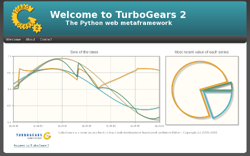

=============================
Using Moksha with TurboGears2
=============================

The best way to learn how to use Moksha within TurboGears2 by example.

:Running demo: http://moksha.csh.rit.edu/apps/jqplotdemo
:Source code: http://lmacken.fedorapeople.org/JQPlotDemo-0.1dev.tar.gz

We'll take a demo written to show off the :mod:`tw.jquery.jqplot` module for
example.  This demo shows off the JQPlotWidget, which queries the server every
2 seconds and reloads the graphs.

Porting this app to use Moksha's LiveWidget would allow us to create a much
more efficient version of this demo, as it would receive data from the server
asynchronously, instead of polling for it.

Now we'll go over and explain each patch required to utilize Moksha within this
TurboGears2 application.

Inject the Moksha Middleware
----------------------------

You will first need to wrap the MokshaMiddleware around your application.

.. code-block:: diff

   --- a/jqplotdemo/config/middleware.py
   +++ b/jqplotdemo/config/middleware.py
   @@ -1,6 +1,8 @@
    # -*- coding: utf-8 -*-
    """WSGI middleware initialization for the JQPlotDemo application."""
    
   +from moksha.middleware import make_moksha_middleware
   +
    from jqplotdemo.config.app_cfg import base_config
    from jqplotdemo.config.environment import load_environment
    
   @@ -32,7 +34,7 @@ def make_app(global_conf, full_stack=True, **app_conf):

        """
   -    app = make_base_app(global_conf, full_stack=True, **app_conf)
   +    app = make_base_app(global_conf, full_stack=True, wrap_app=make_moksha_middleware, **app_conf)
        
        # Wrap your base TurboGears 2 application with custom middleware here

Hooking up the Moksha BaseController
------------------------------------

The easiest way to use moksha is to inherit from it's BaseController.  The
Moksha BaseController does a couple of useful things behind the scenes, such as
adding the global_resources, identity, and the moksha_socket to the
`tmpl_context`.

.. note::

   The `tmpl_context` is availabe in both the :mod:`pylons` and :mod:`tg`
   modules, and provides per-request context to the templates.

.. code-block:: diff

   --- a/jqplotdemo/controllers/root.py
   +++ b/jqplotdemo/controllers/root.py
   @@ -5,7 +5,8 @@ from tw.api import js_function
    from tg import expose, flash, require, url, request, redirect, tmpl_context
    from pylons.i18n import ugettext as _, lazy_ugettext as l_
    
   -from jqplotdemo.lib.base import BaseController
   +from moksha.lib.base import BaseController
   +
    from jqplotdemo.model import DBSession, metadata
    from jqplotdemo.widgets import plot_widget, pie_widget
    from jqplotdemo.controllers.error import ErrorController

.. note::

   If you want to use your own custom BaseController, you can easily add
   the global resources to the `tmpl_context` yourself::

      import moksha
      tmpl_context.moksha_global_resources = moksha.global_resources

Inject the global resources
---------------------------

Moksha has a Global Resource Injection Widget that automatically handles
injecting any JavaScript, CSS or Widgets that you want.  In this example,
as you will see below, there are a couple of widgets on the `[moksha.global]`
entry-point.  

By adding the line of code below to your master template, Moksha will ensure
that your global resources are always injected.

.. code-block:: diff

   --- a/jqplotdemo/templates/master.html
   +++ b/jqplotdemo/templates/master.html
   @@ -35,5 +35,9 @@
        <!-- End of content -->
        ${footer()}
      

   +
   +  ${tmpl_context.moksha_global_resources()}
   +
    </body>
    </html>

Create the Moksha Data Producer
-------------------------------

In the original example, the JQPlotWidget would query a controller every 2
seconds, which returns JSON data.  Since Moksha is event driven, we will create
a Moksha :doc:`Producers` that will wake up every 2 seconds and send new data
to the message bus for a couple of given :doc:`Topics`.  This makes it so our widgets
can simply subscribe to their corresponding topics, and patiently wait for new
data to arrive.

.. code-block:: diff

   --- /dev/null
   +++ b/jqplotdemo/streams.py
   @@ -0,0 +1,17 @@
   +# -*- coding: utf-8 -*-
   +
   +from moksha.api.streams import PollingDataStream
   +from jqplotdemo.controllers.plots import get_plot_data, get_pie_data
   +
   +class JQPlotDemoStream(PollingDataStream):
   +    frequency = 2.0
   +
   +    def poll(self):
   +        self.send_message('jqplot.demo.plot', get_plot_data())
   +        self.send_message('jqplot.demo.pie', get_pie_data())

Making existing widgets "live"
------------------------------

The next step is to convert our old polling widgets to the moksha
:doc:`LiveWidget` API.  So in this case we create a LiveJQPlotWidget class that
inherits from both the JQPlotWidget and the LiveWidget classes.  From here we
simply define a `topic` for the widget to listen to, and an `onmessage`
JavaScript callback, which will get run with each new message.

.. code-block:: diff

   --- a/jqplotdemo/widgets.py
   +++ b/jqplotdemo/widgets.py
   @@ -1,11 +1,23 @@
    import tw.jquery.jqplot
   -from tw.jquery.jqplot import AsynchronousJQPlotWidget
   +from tw.jquery.jqplot import AsynchronousJQPlotWidget, JQPlotWidget
   +from moksha.api.widgets.live import LiveWidget
    
   -plot_widget = AsynchronousJQPlotWidget(id='plot_widget',
   +class LiveJQPlotWidget(JQPlotWidget, LiveWidget):
   +    """ A live plotting Widget, powered by Moksha & tw.jquery.JQPlot
   +
   +    :topic: The topic stream to listen to
   +    :onmessage: Javascript that is called with new messages as they arrive
   +    """
   +    onmessage = AsynchronousJQPlotWidget.callback_reset % '${id}'
   +    topic = None
   +
   +
   +plot_widget = LiveJQPlotWidget(id='plot_widget',
            extra_js=[tw.jquery.jqplot.jqp_dateAxis_js],
   -        src_url='plots', interval=2000)
   +        topic='jqplot.demo.plot')
   +
    
   -pie_widget = AsynchronousJQPlotWidget(id='pie_widget',
   +pie_widget = LiveJQPlotWidget(id='pie_widget',
            extra_js=[tw.jquery.jqplot.jqp_pie_js],
   -        src_url='plots/pie', interval=2000,
   -        width='300px', height='300px')
   +        width='300px', height='300px',
   +        topic='jqplot.demo.pie')

Updating the entry-points
-------------------------

Moksha's plugin architecture is based on `entry-points`.  For this example
app, we simply add our DataStream and a couple of globals to the appropriate
entry points.

Here we add our JQPlotDemo DataStream, along with the `moksha_socket`, which
will setup a persistent publish/subscribe message bus with the server that
all of the widgets can share.

.. code-block:: diff

   --- a/setup.py
   +++ b/setup.py
   @@ -43,5 +43,13 @@ setup(
    
        [paste.app_install]
        main = pylons.util:PylonsInstaller
   +
   +    [moksha.stream]
   +    jqplot_stream = jqplotdemo.streams:JQPlotDemoStream
   +
   +    [moksha.global]
   +    moksha_socket = moksha.api.widgets:moksha_socket
   +
        """,
    )

At this point, you're all set to run ``paster serve development.ini`` and enjoy
your shiny new live web app.

To start the message producing data stream, you will need to run the ``moksha-hub``.

.. --------------------------------------------------------------------------------

   Running your app inside of Moksha
   ---------------------------------
   
   The above example shows how you can easily use Moksha within your existing app.
   Moksha also allows lets you run your app inside of it.  Moksha is preconfigured
   to run in an Apache & mod_wsgi environment, which will handle loading and
   mounting your apps within itself.
   
   
   .. warning::
   
      If you're running your app inside of Moksha, you must ensure that you
      are not running the MokshaMiddleware inside of your app first.  This
      currently leads to a fun infinite WSGI middleware loop :)
   
      So if you're creating a new app, don't worry about this, but for the above
      example, just remove the `wrap_app=make_moksha_middleware` from your
      `jqplotdemo/config/middleware.py`
   
   
   Create your WSGI app
   ~~~~~~~~~~~~~~~~~~~~
   
   If your app is already WSGI-mountable, then don't worry about this.  For a TurboGears2 app, it's as easy as:
   
   .. code-block:: diff
   
      --- /dev/null
      +++ b/jqplotdemo/wsgi.py
      @@ -0,0 +1,2 @@
      +from paste.deploy import loadapp
      +application = loadapp('config:/etc/moksha/conf.d/jqplotdemo/production.ini')
   
   
   Make a production configuration
   ~~~~~~~~~~~~~~~~~~~~~~~~~~~~~~~
   
   In production we want to make sure any caches are setup in the right spot.
   We base the `production.ini` on our existing `development.ini`, and make a tiny tweak.
   
   .. code-block:: diff
   
      --- development.ini
      +++ production.in
      @@ -23,7 +23,7 @@
       use = egg:JQPlotDemo
       lang = en
      -cache_dir = %(here)s/data
      +cache_dir = /var/cache/moksha/jqplotdemo/data
       beaker.session.key = jqplotdemo
   
   .. code-block:: diff
   
      --- a/ MANIFEST.in      
      +++ b/ MANIFEST.in      
      @@ -2,3 +2,4 @@ recursive-include jqplotdemo/public *
       include jqplotdemo/public/favicon.ico
       recursive-include jqplotdemo/i18n *
       recursive-include jqplotdemo/templates *
      +include production.ini
   
   
   Integrate your TG2/WSGI app into Moksha
   ~~~~~~~~~~~~~~~~~~~~~~~~~~~~~~~~~~~~~~~
   
   You can plug your WSGI application into Moksha by using the `moksha.wsgiapp`
   entry-point.
   
   .. code-block:: diff
   
      --- a/ setup.py 
      +++ b/ setup.py 
      @@ -47,6 +47,9 @@ setup(
           [moksha.stream]
           jqplot_stream = jqplotdemo.streams:JQPlotDemoStream
       
      +    [moksha.wsgiapp]
      +    jqplotdemo = jqplotdemo.wsgi:application
      +
           [moksha.global]
           moksha_socket = moksha.api.widgets:moksha_socket
   
   
   .. seealso::
   
      :doc:`PluginEntryPoints`
   
   
