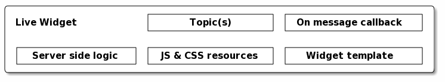
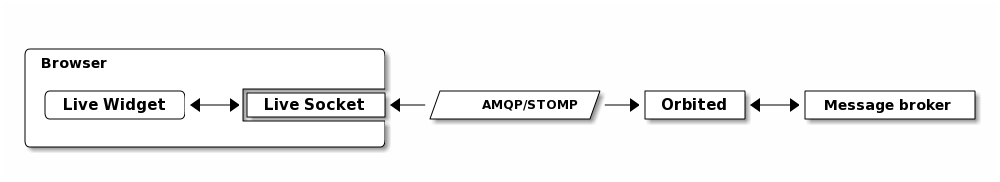

============
Live Widgets
============

Moksha provides a :class:`LiveWidget` that handles automatically subscribing
your widget to a given message `topic`, or list of topics.  When the widget
receives a new message, the `onmessage` JavaScript callback will be run by the
client with JSON data in the `json` variable.

A basic LiveWidget
------------------

Below is an example of a really basic live widget.  This widget subscribes to
the 'stuff' message topic, and will perform an `alert` upon new messages.

.. code-block:: python

    from moksha.api.widgets.live import LiveWidget

    class MyLiveWidget(LiveWidget):
        topic = 'stuff'
        onmessage = 'alert(json);'
        template = "Hi, I'm a live widget!"

Live Feeds
----------

A Live Feed Demo Widget
~~~~~~~~~~~~~~~~~~~~~~~

.. code-block:: python

    from moksha.api.widgets.feed.live import LiveFeedWidget

.. widgetbrowser:: moksha.widgets.demos.LiveFeedDemo
   :tabs: demo, source, template, parameters
   :size: large

The Live Feed Widget
~~~~~~~~~~~~~~~~~~~~

The :class:`LiveFeedWidget` itself is just a simple :class:`LiveWidget` that
uses a little bit of jQuery to add and remove feed entries from a list.

.. code-block:: python

    from moksha.api.widgets.live import LiveWidget
    from moksha.api.widgets.feed import Feed

    class LiveFeedWidget(LiveWidget):
        """ A live streaming feed widget """
        params = {
                'url': 'The feed URL',
                'topic': 'A topic or list of topics to subscribe to',
                'feed': 'A moksha Feed object',
        }
        template = '${feed(id=id, url=url)}'
        onmessage = """
            $.each(json, function() {
                $("#${id} ul li:last").remove();
                $("<li/>").html(
                    $("<a/>")
                      .attr("href", this.link)
                      .text(this.title))
                  .prependTo($("#${id} ul"));
            });
        """
        feed = Feed()

Live Widget Interaction
-----------------------

Dependency on GlobalResourceInjectionWidget
-------------------------------------------

Under the hood, each :class:`LiveWidget` depends on the
:class:`GlobalResourceInjectionWidget`
to render the the javascript callbacks for their topics.  Due to the way
this works, you should ensure that the global resources are injected
*last*, after each LiveWidget is rendered.
