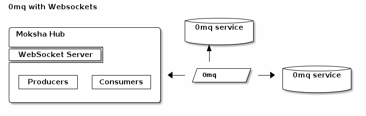

Messaging Scenarios
===================

.. image:: ../_static/moksha-messaging-stomp.png

Pros:
    - No configuration needed
    - Works out-of-the-box
Cons:
    - Not designed for scalability
    - No wildcard topic names

.. image:: ../_static/moksha-messaging-stomp-amqp.png

Pros
    - STOMP/AMQP broker bridging
Cons
    - Not very well tested
    - May or may not work as expected

.. image:: ../_static/moksha-messaging-amqp.png

Pros:
    - Trivial to configure
    - 100% AMQP, from the browser to the broker
    - Flexibility and power of AMQP queues, exchanges, routing keys, etc.
Cons:
    - Relatively new and not 100% complete JavaScript bindings

Pros:
    - Uses native WebSockets, not a giant javascript shim
    - Blazing fast.  ~100 times faster hub processing
    - Distributed.  No central broker
    - Only `moksha-hub` and the WSGI stack.  No orbited, no broker.
Cons:
    - Uses native WebSockets, not supported on all browsers
    - No built in persistance or delivery guarantee

.. seealso::

   See :doc:`MessageBrokers` for more information on configuring various
   protocols and brokers with Moksha.
