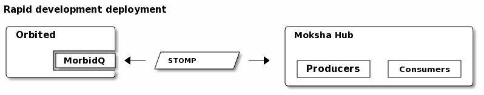
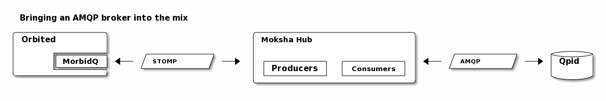

Messaging Scenarios
===================

Pros:
    - No configuration needed
    - Works out-of-the-box
Cons:
    - Not designed for scalability
    - No wildcard topic names

Pros
    - STOMP/AMQP broker briding
Cons
    - Not very well tested
    - May or may not work as expected

Pros:
    - Trivial to configure
    - 100% AMQP, from the browser to the broker
    - Flexibility and power of AMQP queues, exchanges, routing keys, etc.
Cons:
    - Relatively new and not 100% complete JavaScript bindings
