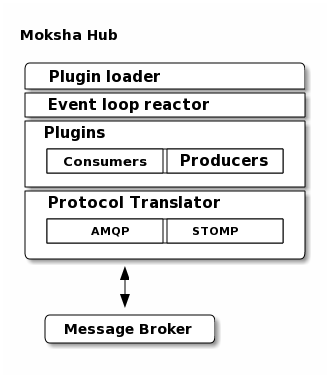

==============
The Moksha Hub
==============

MokshaHub
---------

Moksha provides a :class:`moksha.hub.MokshaHub` class that makes it simple for
applications to send messages to a given topic.

.. code-block:: python

    from moksha.api.hub import MokshaHub, reactor
    hub = MokshaHub()
    hub.send_message('topic', 'message')
    reactor.run()
    hub.close()

Behind the scenes, the :class:`MokshaHub` will automatically connect up to
whatever message brokers are configured, and create a new session.  The
:meth:`send_message` method will automatically handle encoding your message to
JSON (unless you pass `jsonify=False`), and sending it to the appropriate
message broker.

CentralMokshaHub
----------------

The :class:`CentralMokshaHub` is the primary consumer of all message `topics`.
It runs outside of the Moksha WSGI application stack, and is automatically
started by the `start-moksha` script (and can be started manually by running `moksha-hub`.

The :class:`CentralMokshaHub` currently handles the following tasks:

* Feeds :doc:`Consumers` new messages for specific topics
* Runs all of the :doc:`Producers`

