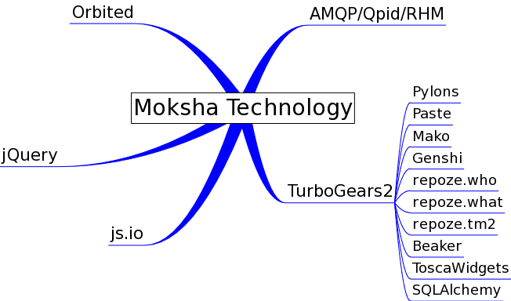

The technology that powers Moksha
=================================

Python
------
An high-level interpreted, interactive, object-oriented programming language.

`TurboGears <http://turbogears.org>`_, `Pylons <http://pylonshq.org>`_, `Paste <http://pythonpaste.org>`_
---------------------------------------------------------------------------------------------------------

The frameworks that provide our `WSGI <http://wsgi.org>`_ application and
middleware stack.

WSGI Middleware
---------------

Powerful pre-existing middleware components provide massive functionality on
top of existing applications.  Standard middleware includes `repoze.what
<http://static.repoze.org/whatdocs/>`_ for authorization, `ToscaWidgets
<http://toscawidgets.org>`_ for resource injection, `Beaker
<http://wiki.pylonshq.com/display/beaker>`_ for sessions and caching, `Paste
<http://pythonpaste.org>`_ for the Registry Manager, and `WebError
<http://pypi.python.org/pypi/WebError>`_ for robust error handling and
debugging.

`ToscaWidgets <http://toscawidgets.org>`_
-----------------------------------------

The powerful API for creating reusable "Widgets", which are essentially just
bundles of HTML, JavaScript, CSS, and render-time logic.  ToscaWidgets also
provides a piece of WSGI middleware that handles intelligent resource
inejection.

`Mako <http://www.makotemplates.org/>`_ and `Genshi <http://genshi.edgewall.org/>`_
-----------------------------------------------------------------------------------

Powerful templating languages that can be used for widgets or other
applications.

`SQLAlchemy <http://sqlalchemy.org>`_
-------------------------------------

A powerful `Object Relational Mapper <http://en.wikipedia.org/wiki/Object-relational_mapping>`_ that makes it simple
for plugins/widgets/applications to transparently utilize relational databases
such as SQLite/MySQL/PostgreSQL/etc.

`jQuery <http://jquery.com>`_
-----------------------------

jQuery is a fast and concise JavaScript Library that simplifies HTML document
traversing, event handling, animating, and Ajax interactions for rapid web
development. jQuery is designed to change the way that you write JavaScript.

`Orbited <http://orbited.org>`_
-------------------------------

Real-time communication for the web browser.  Orbited provides a pure
JavaScript/HTML socket in the browser.  It is a web router and firewall that
allows you to integrate web applications with arbitrary back-end systems.

`js.io <http://js.io>`_
-----------------------

Simplifies creating rich web applications by providing direct integration with
open protocols.

`AMQP <http://amqp.org/>`_/`Qpid <http://incubator.apache.org/qpid/>`_
---------------------------------------------------------------------------------------------------------

`AMQP <http://amqp.org/>`_ is an open Internet Protocol for Business Messaging.
`Qpid <http://incubator.apache.org/qpid/>`_ is a message broker daemon that
receives, stores, and routes messages using the AMQP protocol.

`Twisted <http://twistedmatrix.com>`_
-------------------------------------

Twisted is an event-driven networking engine written in Python.  It is the core engine for the :doc:`MokshaHub`, which reacts to incoming messages, as well as runs our :doc:`Producers`.
