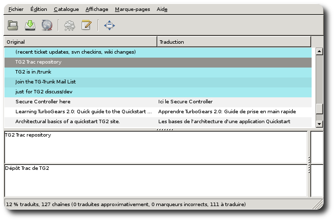

Handling internationalization and localization
===============================================

:Status: Work in progress

.. contents:: Table of Contents
    :depth: 2

Turbogears2 relies on Pylons and Babel for i18n and l10n support. So if this
document is not enough you will want to check their respective documentation:

 * Pylons' `Internationalization and Localization`_ doc (which also contains
   "Using Babel" section)
 * Babel's UserGuide_

A quickstarted project comes fully i18n enabled so you should get started
quickly.

If you're lucky enough you'll even see "Your application is now running"
message in your language.

Language auto-select
--------------------

Turbogears2 contains the logic (hardwired in the TurboGearsController class 
at the moment) to setup request's language based on browser's preferences(*). 

[*] - Every modern browser sends a special header along with every web 
request which tells the server which language it would prefer to see in a 
response. 

An i18n Quick Start
-------------------

After quickstarting your project, you will notice that the setup.py file
contains the following section::

    message_extractors = {'yourapp': [
             ('**.py', 'python', None),
             ('templates/**.mako', 'mako', None),
             ('templates/**.html', 'genshi', None),
             ('public/**', 'ignore', None)]},

This is an extraction method mapping that indicates to distutils which files
should be search for strings to be translated.
TurboGears2 uses Babel to extract messages to a .pot file in your project's
i18n directory.
Don't forget to add it to your revision control system if you use one.

1. Extract all the translatable strings from your project's files
by using the following command::

    python setup.py extract_messages

This command will generate a "pot" file in the i18n folder of your application.
This pot file is the reference file that serves for all the different
translations.

2. Create a translation catalog for your language, let's take 'zh_tw' for 
   example::

    python setup.py init_catalog -l zh_tw

3. Edit your language in il8n/[country code]/LC_MESSAGES/[project-name].po  

If you're not an expert in i18n or if you would like to give the files to
someone else so that he helps you we recommand that you use the really nice
poedit program. This program works nicely on GNU/Linux and Windows
and provides a nice user-interface to edit po files.

4. Compile your lang::

    python setup.py compile_catalog  

5. Config development.ini::

    [app:main]
    use = egg: my-project
    full_stack = true
    lang = zh_tw

6. Start server::

    paster serve --reload development.ini

And see the local message show on the screen.

Commands
---------

To fresh start a translation, you could use following command to handle your 
locales:

init_catalog
~~~~~~~~~~~~~

You can extract all messages from the project with the following command::

  python setup.py init_catalog -l [country code]

The country code could be es(Spanish), fr(France), zh_tw(Taiwan), jp(JAPAN), 
ru(Russian), or any other country code.

Compile Catalog
~~~~~~~~~~~~~~~~

You can extract all messages from the project with the following command::

  python setup.py compile_catalog

Update Catalog
~~~~~~~~~~~~~~~

You can update the catalog with the following command::

  python setup.py update_catalog

.. _`Internationalization and Localization`: http://wiki.pylonshq.com/display/pylonsdocs/Internationalization+and+Localization
.. _UserGuide: http://babel.edgewall.org/wiki/Documentation/index.html
